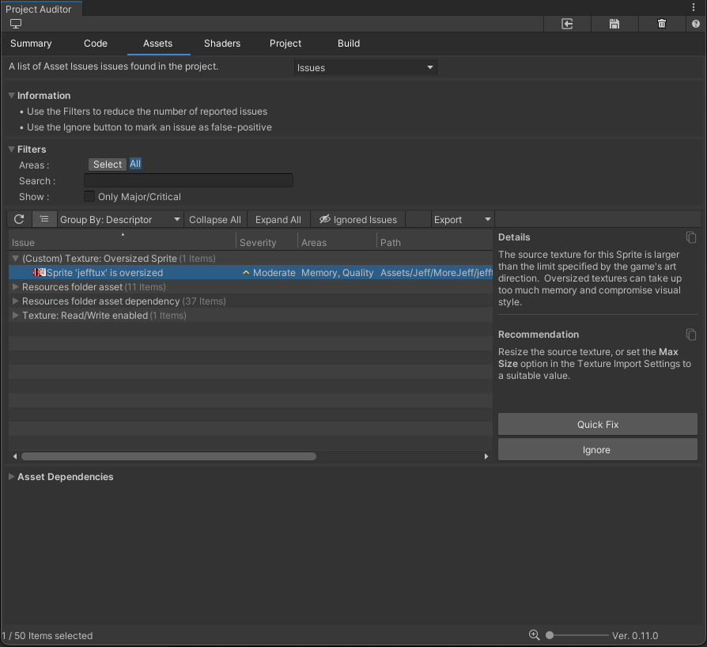

<a name="APICustomAnalyzers"></a>
# Creating Custom Analyzers
Project Auditor provides an API for creating custom analyzers tailored to the needs of your project.

Internally, Project Auditor creates and maintains a number of different Modules. These are as follows:

* Animation
* Assets
* AudioClip
* BuildReport
* Code
* Mesh
* Packages
* Settings
* Shader
* SpriteAtlas
* Texture

Every Module has a corresponding class
inheriting from `ModuleAnalyzer` which declares an `Analyze()` method which takes a type inheriting from
`AnalysisContext`. During analysis, the Module uses reflection to detect and create instances of any Analyzer classes
inheriting from its corresponding `ModuleAnalyzer`, then constructs `AnalysisContext` objects and passes them to the
Analyzers.

Here's an example showing how to create a custom Analyzer. Imagine a texture-heavy 2D game with a pixel art visual
style. In such a project it might be desirable to enforce maximum sizes for Sprite texture assets in order to help
manage memory and to enforce a consistent visual resolution. A custom Analyzer to report oversized sprites might look
like this:

```
using System;
using System.Collections.Generic;
using Unity.ProjectAuditor.Editor;
using Unity.ProjectAuditor.Editor.Core;
using UnityEditor;

// Inherit from TextureModuleAnalyzer to allow TextureModule to create and run an
// instance of this analyzer.
class CustomTextureAnalyzer : TextureModuleAnalyzer
{
    // Define our custom maximum sprite size
    const int k_MaxSpriteSize = 1024;
    
    // Data for constructing a descriptor.
    const string k_SpriteTooBigId = "PAA9000";  // Make sure this ID is unique.
    const string k_Title = "(Custom) Texture: Oversized Sprite";
    const Areas k_ImpactedAreas = Areas.Memory | Areas.Quality;
    const string k_Description =
        "The source texture for this Sprite is larger than the limit specified by " + 
        "the game's art direction. Oversized textures can take up too much memory " +
        "and compromise visual style.";
    const string k_Recommendation =
        "Resize the source texture, or set the <b>Max Size</b> option in the " +
        "Texture Import Settings to a suitable value.";
    
    // Declare a Descriptor to describe the issue we want to report.
    static readonly Descriptor k_CustomSpriteTooBigDescriptor = new Descriptor
    (
        k_SpriteTooBigId,
        k_Title,
        k_ImpactedAreas,
        k_Description,
        k_Recommendation
    )
    {
        // As well as the constructor parameters above, this area can be used to set
        // the values of other Descriptor fields.
        
        // Project Auditor will format this message using the Name that's passed into
        // CreateIssue.
        MessageFormat = "Sprite '{0}' is oversized", 
        
        // Optionally declare a delegate to fix the issue in a single button click. 
        Fixer = (issue, analysisParams) =>
        {
            var textureImporter =
                AssetImporter.GetAtPath(issue.RelativePath) as TextureImporter;
            
            if (textureImporter != null)
            {
                textureImporter.maxTextureSize = k_MaxSpriteSize;
                textureImporter.SaveAndReimport();
            }
        }
    };

    // Declare m_CustomSpriteSizeLimit as a DiagnosticParam. Give the parameter a
    // unique name and a sensible default.
    [DiagnosticParameter("CustomSpriteSizeLimit", k_MaxSpriteSize)]
    int m_CustomSpriteSizeLimit;

    // Override the initialize method in order to pass the custom Descriptor to the
    // registerDescriptor Action so that ProjectAuditor knows about it.
    public override void Initialize(Action<Descriptor> registerDescriptor)
    {
        registerDescriptor(k_CustomSpriteTooBigDescriptor);
    }

    // Implementation of the custom Analyze coroutine method. In the case of a class
    // inheriting from TextureModuleAnalyzer, the AnalysisContext passed to this
    // method is a TextureAnalysisContext.
    public override IEnumerable<ReportItem> Analyze(TextureAnalysisContext context)
    {
        // Check to see if a texture is treated as a sprite, and check its dimensions
        if (context.Importer.textureType == TextureImporterType.Sprite &&
           (context.Texture.width > m_CustomSpriteSizeLimit ||
            context.Texture.height > m_CustomSpriteSizeLimit))
        {
            // Create the issue with the correct category, DescriptorId, name and path
            yield return context.CreateIssue(IssueCategory.AssetIssue,
                    k_CustomSpriteTooBigDescriptor.Id, context.Name)
                .WithLocation(context.Importer.assetPath);
        }
    }
}
```

This script demonstrates how to declare and register a `Descriptor`, including its custom Fixer. It shows how to use
`DiagnosticParameterAttribute` to declare a diagnostic parameter for use during analysis. It demonstrates how
to access the contents of the `context` structure passed to it to decide whether to report an Issue. Finally, it shows
how to create the Issue, including specifying the IssueCategory which dictates the View in which the Issue will appear
and the information that will be shown in the Issue table.



## Slow Analyzers
The analysis for some Issues can take a long time to run, particularly in a large project. The `Descriptor` for such
issues may declare `Descriptor.IsEnabledByDefault` to be false to stop them running when running Project
Auditor interactively in the Editor. When running Project Auditor in a CI/CD environment it may be desirable to
re-enable analysis for these Descriptors. `AnalysisParams.WithAdditionalDiagnosticRules` can be used to add temporary
`Rule`s to increase the `Severity` of a Descriptor to anything other than `Severity.None` in order to re-enable analysis
in this context.

## A Guide to writing Descriptor text

The Project Auditor team use the following guidelines when writing the strings that appear in Descriptors for the Issues
the tool reports out of the box. You may find the guidelines useful when writing Descriptors for custom Analyzers.

### General advice
* Follow the *“What -> So What -> Now What”* structure. 
  * The first sentence of a Description field should have a short sentence that describes *what* Project Auditor has discovered
  * The second sentence should answer the *“so what”* question: what undesirable results might the Issue cause?
  * Finally, the Recommendation string should tell you what you should do (or consider, or try) if you want to fix the problem (*“now what?”*).
* Use **bold** for the name of APIs and settings options in both the description and the recommendation. Do this by adding `<b>` and `</b>` tags before and after the name.
* Description/Recommendation strings are full sentences, which end with full stops. Titles are titles, and don’t have full stops. MessageFormat is a formattable title string, so also has no full stop.
* Method names should end with a pair of empty parentheses. Property names shouldn’t. For example "`<b>Object.FindObjectOfType()</b>`", or “`<b>Camera.main</b>`”.

### Issue title
* For issues relating to settings, the title string should follow the format: “`<Settings Page>: <Setting Name> is <enabled/not enabled/set to X>`” It should not contain the full path to that setting. For example:
  * “`Player: Scripting Backend is set to Mono`” ← **GOOD**
  * “`Player: Scripting Backend`” ← **BAD**. Doesn’t say what the actual problem is
  * “`Scripting Backend is set to Mono`” ← **BAD**. No indication of the general area
  * “`Player: Other Settings > Configuration > Scripting Backend is set to Mono`” ← **BAD**: using full path - save that for the Recommendation string
* Don’t use rich text in title or messageFormat strings. No `<b>`bold`</b>` tags, for example. These fields don’t support rich text in the UI so it will look bad.

### Descriptions
* Remember to name the API/option in the description.
* If it’s an option in the description, say *where* the option is and use the exact wording, spacing and capitalization that’s used in the Editor UI. For example:
  * “`<b>Auto Sync Transforms</b> in Physics Settings...`”
  * “`<b>Read/Write Enabled</b> in Texture Import Settings...`"
* Following the above point, in the description just name the setting and the page it can be found on, not the full path. “`<b>Scripting Backend</b> in Player Settings...`” is good, “`<b>Player > Other Settings > Configuration > Scripting Backend</b>`” is not good.
* Remember a description consists of two parts: What Project Auditor found, and what that might mean for the project. Don’t ever just say “`X is enabled.`”, say what can happen as a result.
  * For code issues, using one sentence is acceptable: “`X allocates managed memory.`”, or “`X takes a lot of CPU time.`”
  * For settings issues, two sentences reads more clearly and allows you to say what the setting is currently set to. “`X is enabled. As a result, texture memory footprint is increased.`”
* For managed allocations, it’s okay to just say “`X allocates managed memory.`” and assume that the user knows that frequent managed allocations are bad. You don’t have to try to explain how the managed heap or garbage collection works.
* Don’t ever just say “`X is expensive.`” or “`X causes slowdowns.`". “Expensive” should be avoided entirely, and “causes slowdowns” doesn’t say WHAT slows down - CPU, GPU, loading times? Be more specific.
* Use precise, confident language where you’re reasonably sure of something (“`X takes a lot of CPU time`”) but where the situation is more nuanced than Project Auditor can easily detect, it’s okay to use more conditional language (“`X can take a lot of CPU time under certain circumstances`”, etc.)

### Recommendation
* Recommendation string should be as concise as reasonably possible, 1-3 short sentences.
* Recommendation string doesn’t need to start with what will happen if you follow the recommendation - the bad thing that would be fixed should already have been described in the Description. Just get right to it.
  * *BAD*: “`To reduce GPU memory, enable <b>Mipmap Streaming</b> in the Texture Import Settings...`”
  * *GOOD*: “`Enable <b>Mipmap Streaming</b> in the Texture Import Settings...`"
* If recommending to avoid something, give an alternative if one exists. Otherwise, just caution against using that thing outside of initialization code.
* For assets, the options being audited live in that asset type’s Import Settings. For example: “`Texture Import Settings`”, not “`Texture inspector`”.
* When describing a location in the UI or a path through a menu, use the `>` character rather than `➔`.
* Use precise, confident language where you’re reasonably sure of something (“`Disable X in Y Settings.`”) but where the situation is more nuanced than Project Auditor can easily detect, it’s okay to use more conditional language (“`Consider disabling X in Y Settings. This may reduce CPU time, but might also increase memory usage.`”, etc.)

