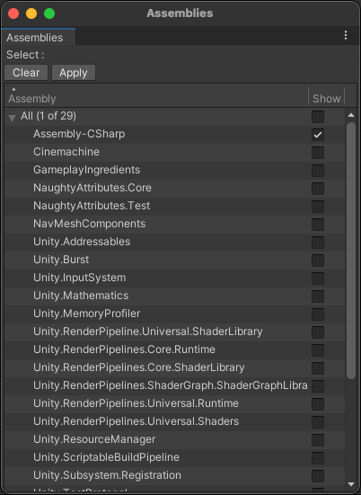

# Assemblies View
This is an experimental view that reports a list of all compiled Assemblies. This includes all Assemblies generated by code under Assets folder as well as packages. 

Note that the *Read Only* column specifies whether the source files of an assembly can be modified in the Unity project. Packages installed from a registry or from a repository are typically *Read Only*.
