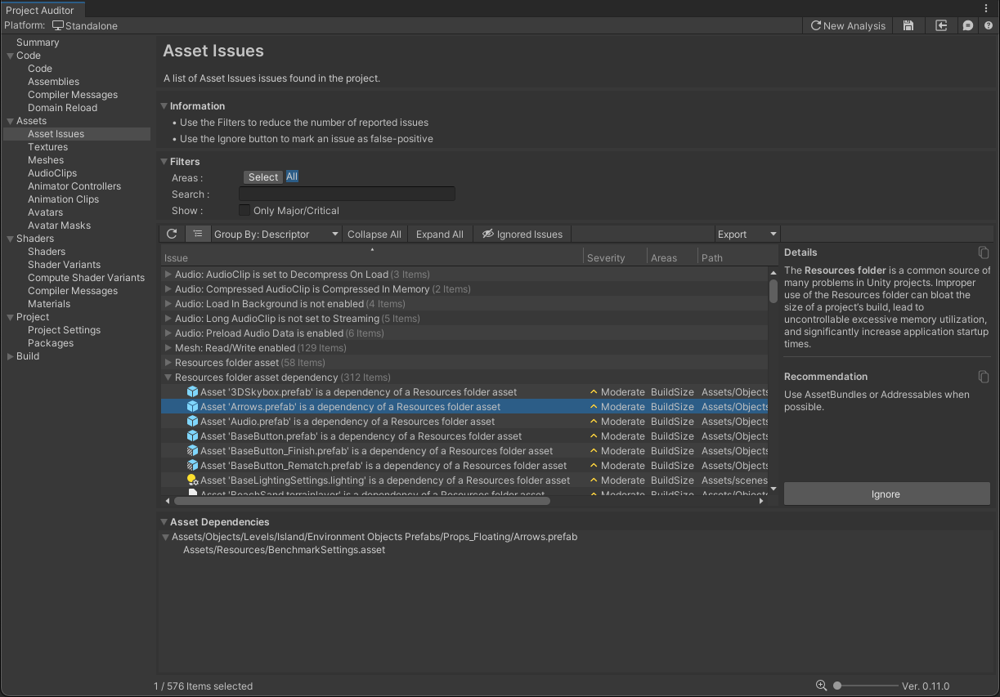

# Assets Issues View
The Assets Issues View reports asset-related issues. For each issue, this view also provides an explanation
of the problem and a recommended course of action to resolve the issue.

## Asset Dependencies

For Assets Issues relating to dependency chains, such as the Resources folder dependency shown in the image above, the
bottom panel shows an asset dependency tree. At the root level of the tree is the asset itself. Expanding the tree one
level shows all of the assets that reference that asset. This reference chain can continue to be expanded until an asset
that is explicitly included in a build is encountered - in this case, because the asset is inside a Resources folder.

## Issue table

The table columns are as follows:

| Column Name | Column Description                                                                                                                                                                    | 
|-------------|---------------------------------------------------------------------------------------------------------------------------------------------------------------------------------------|
| **Issue**   | A brief description of the Issue.                                                                                                                                                     |
| **Severity** | An estimate of how severe the issue might be for your project (Critical/Major/Moderate/Minor).                                                                                        |
| **Areas**   | The area(s) impacted by the Issue. Assets Issues typically impact Build Size, Memory, Quality or CPU/GPU perfomance.                                                                  |
| **Path**    | The full path and file name of the asset in which the Issue was found. Double-click on any issue to select the corresponding asset in the Project window to view it in the Inspector. |

As in other Issues Views, this View provides several filtering tools. These are often useful to narrow down the list of
reported issues, especially on large projects. The [Getting Started](GettingStarted.md) guide contains a more detailed description of
the View Filter Panel.

As with other Issues Views, selected issues also display an **Ignore** button in the selected item detail panel, which
can be useful in cases where Project Auditor reports false positives. If you have investigated a reported issue and
concluded that it's not a real problem, select the issue and click the Ignore button to hide it.
