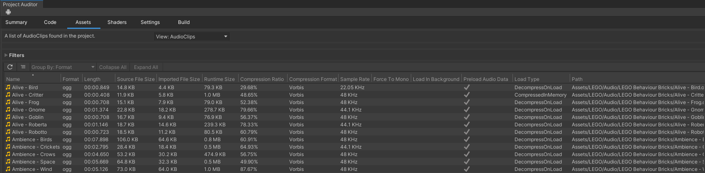

# AudioClip View
This view reports all AudioClips in the project.

### Reported Properties: ###
•	Name  
•	Format  
•	Length  
•	Source File Size  
•	Imported File Size  
•	Runtime Size  
•	CompressionRatio  
•	Compression Format  
•	Force To Mono  
•	Load In Background  
•	Preload Audio Data  
•	Load Type  
•	Path