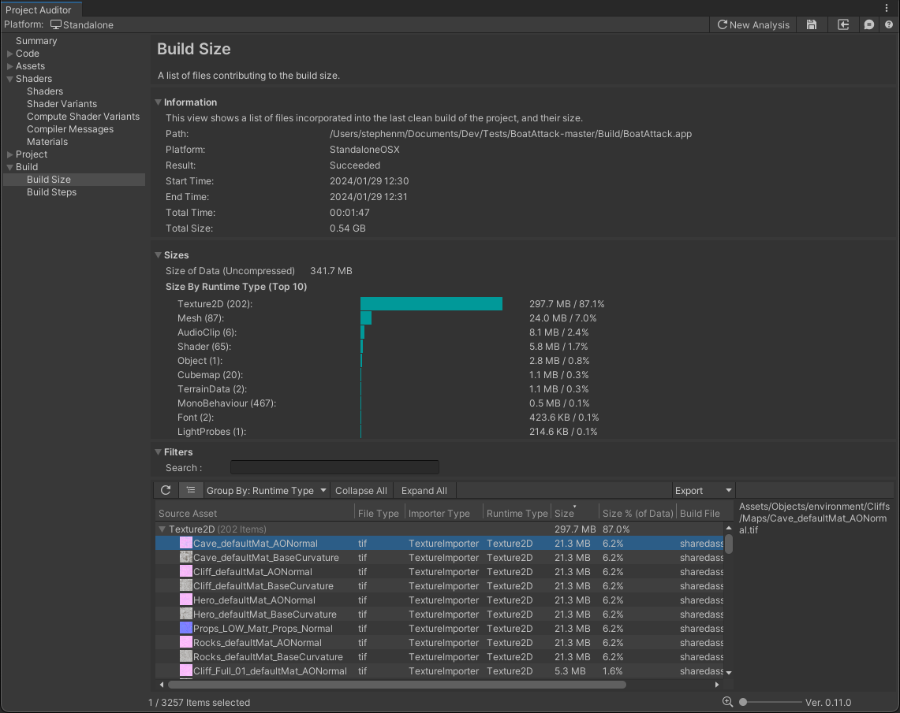

# Build Size View
This view shows all build file sizes from the last [BuildReport](https://docs.unity3d.com/ScriptReference/Build.Reporting.BuildReport.html).

* *Source Asset*: filename of the source asset
* *Type*: file type of the source asset
* *Size*: size of the file, converted for the target platform
* *Path*: full path of the source asset
* *Build File*: filename of the archive containing the file

Note that this view is available when using Unity 2019.4 or newer.
