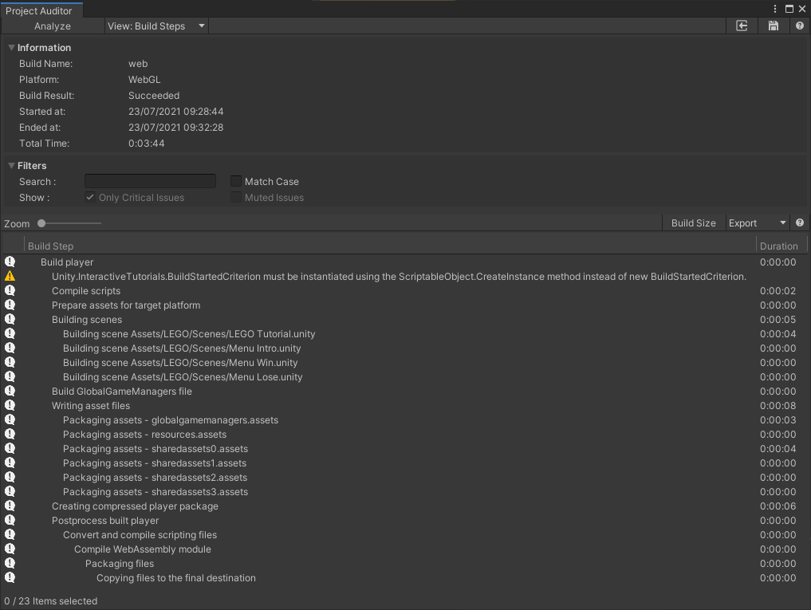

# Build Steps View
This view shows all build steps from the last [BuildReport](https://docs.unity3d.com/ScriptReference/Build.Reporting.BuildReport.html).

Note that this view is available when using Unity 2019.4 or newer.
