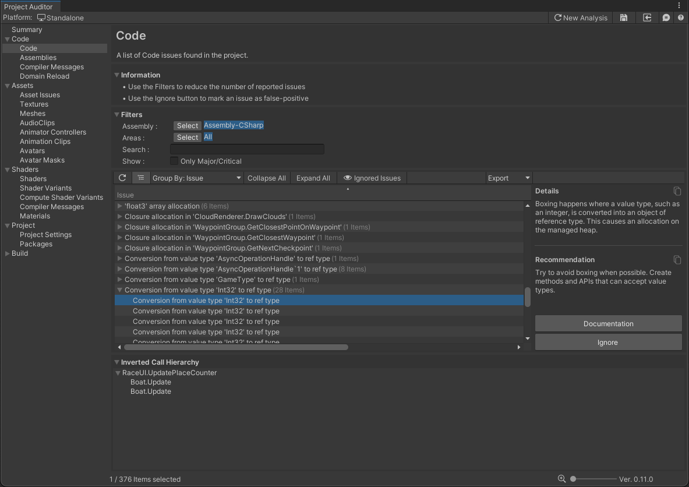

# Code View
This view reports all Script-related diagnostics. For each issue, this view also provides an explanation of the problem and a possible solution.

Note that some issues are denoted as *Critical*: this indicates the issues were found in hot-paths such as a *MonoBehaviour.Update*. 

As other diagnostic views, it allows the user to filter by several criterias. These are often useful to narrow down the list of reported issues, especially on large projects.

If the user determines a reported issue is not relevant or is a false positive, it is possible to select it and silence it by using the *Mute* option. By doing this, the selected issue is not going to be reported on the next analysis.

## Known limitations
Here are several Project Auditor's code analysis limitations:
* It reports issues in code that might be stripped by the build process.
* It cannot distinguish between different versions of an API method with different parameters/return types: for example, it can't differentiate between public Component[] GetComponentsInChildren(Type type, bool includeInactive = false); (which allocates managed memory) and public void GetComponentsInChildren(List<T> results); (which doesn't), so it reports both.
* It is unable to distinguish between "hot" and "cold" code paths, except by checking if a method is in (or is a called by) one of the standard MonoBehaviour (Fixed/Late)Update methods.
* The call tree analysis does not support virtual methods.
