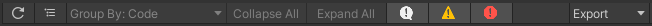

# Compile Messages View
This view shows the compiler error, warning and info messages. These messages are generated by the C# compiler when
compiling the project scripts for the target platform. Note that this occurs during the Project Auditor Analysis.

The table view control bar in this view features additional buttons which can be used to toggle the display of compiler
messages, warnings and errors.

The table columns are as follows:

| Column Name         | Column Description                                                                                                                                                             | 
|---------------------|--------------------------------------------------------------------------------------------------------------------------------------------------------------------------------|
| **Log Level**       | The log level of the compiler message (Error/Warning/Info).                                                                                                                    |
| **Code**            | The error/warning code reported by the compiler.                                                                                                                               |
| **Message**         | The error/warning message string reported by the compiler. If you select an item in the table, this message will also be shown in the selected item detail panel to the right. |
| **Filename**        | The file name and line number that generated the message. Double-click on any report item to automatically open the file in your IDE and jump to the correct line.             |
| **Target Assembly** | The assembly which contains the file that generated the message. The default assembly for user code in a Unity project is called `Assembly-CSharp`.                            |
| **Full Path**       | The full path to the code file that generated the message.                                                                                                                     |

# Roslyn Analysis
Unity supports Roslyn analyzers. This feature reports all Roslyn diagnostics in the Console window. Project Auditor's
Compiler Messages View provides an alternative way to report Roslyn diagnostics.

This feature requires one or more Roslyn analyzer DLLs in the Unity project, tagged with the *RoslynAnalyzer* label. In
order to add a label, click in the DLL in the Project Browser and use the inspector:

For more information on Roslyn Analyzers support in Unity, check the [manual](https://docs.unity3d.com/Manual/roslyn-analyzers.html).
