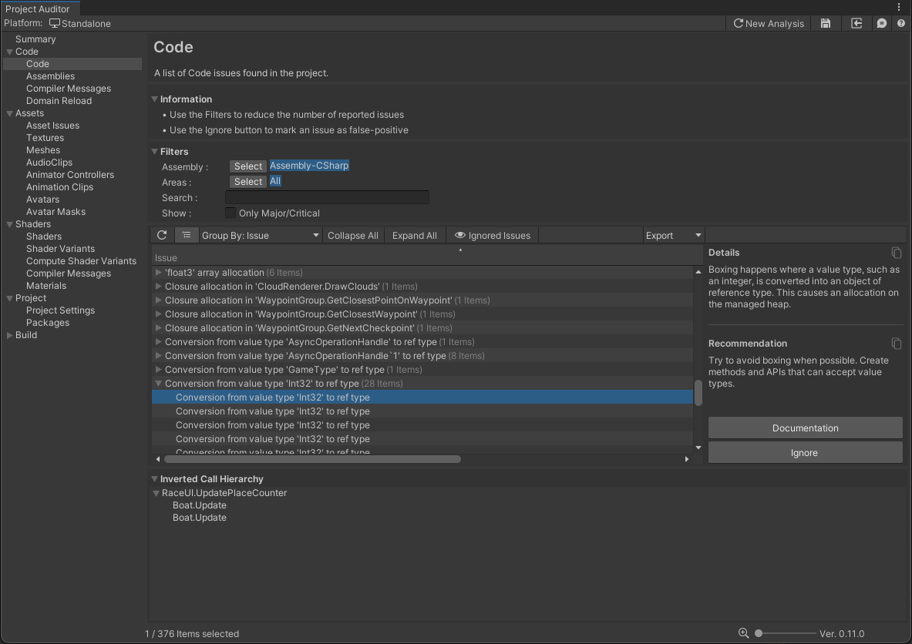

# Code Issues View
The Code Issues View reports all C# script-related Issues. For each Issue, this view also provides an explanation
of the problem and a recommended course of action to resolve the issue.

### Show
Ticking the **Only Major/Critical** checkbox will show only code issues that have an inverted call hierarchy that
includes an update method - for example coroutine methods, or built-in methods such as `MonoBehaviour.Update()`,
`MonoBehaviour.FixedUpdate()`, `SystemBase.OnUpdate()`, `ISystem.OnUpdate()`, among others. This allows you to focus on
issues that are more likely to occur in "hot" code paths that are called every frame. Code in hot paths is more likely
to have an impact on runtime performance or memory management than code which runs only during initialization.

## Inverted call hierarchy
This panel shows an inverted call hierarchy for the currently-selected Issue in the table. Expanding the tree reveals
all of the methods which lead to the call site of the reported issue. The panel only shows an inverted call hierarchy
if code analysis was performed during this Editor session - call hierarchies are not currently saved in Reports
for later viewing. If you see `<Missing Data: Please Analyze>` in this view, click the **Refresh** (&#x27F3;) button
above the table to re-run code analysis.

## Issue table

The table columns are as follows:

| Column Name  | Column Description                                                                                                                                                                                         | 
|--------------|------------------------------------------------------------------------------------------------------------------------------------------------------------------------------------------------------------|
| **Issue**    | A brief description of the Issue                                                                                                                                                                           |
| **Severity** | An estimate of how severe the issue might be for your project (Critical/Major/Moderate/Minor). Issues that were found in hot-paths such as a MonoBehaviour.Update() are automatically denoted as Critical. |
| **Areas**    | The area(s) impacted by the Issue. Code Issues typically impact CPU performance and/or Memory usage.                                                                                                       |
| **Filename** | The file name and line number where the Issue was found. Double-click on any issue to automatically open the file in your IDE and jump to the correct line.                                                |
| **Assembly** | The assembly which the code file is a part of.                                                                                                                                                             |

As in other Issues Views, this View provides several filtering tools. These are often useful to narrow down the list of
reported issues, especially on large projects. The [Getting Started](GettingStarted.md) guide contains a more detailed description of
the View Filter Panel.

As with other Issues Views, selected issues also display an **Ignore** button in the selected item detail panel, which
can be useful in cases where Project Auditor reports false positives. If you have investigated a reported issue and
concluded that it's not a real problem, select the issue and click the Ignore button to hide it.

## Known limitations
There are several known limitations in Project Auditor's code analysis:
* It reports issues in code that might be stripped by the build process.
* It cannot distinguish between different versions of an API method with different parameters/return types: for example, it can't differentiate between `public Component[] GetComponentsInChildren(Type type, bool includeInactive = false);` (which allocates managed memory) and `public void GetComponentsInChildren(List<T> results);` (which doesn't), so it reports both.
* It is unable to distinguish between "hot" and "cold" code paths, except by checking if a method is in (or is a called by) one of the standard `MonoBehaviour (Fixed/Late)Update` methods, or `SystemBase/ISystem.OnUpdate`, or a coroutine.
* The call tree analysis does not support virtual methods.
