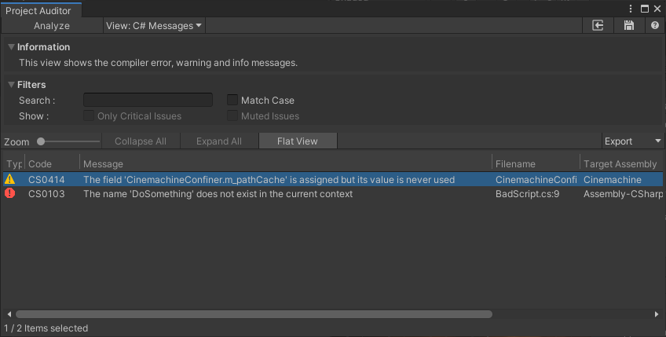
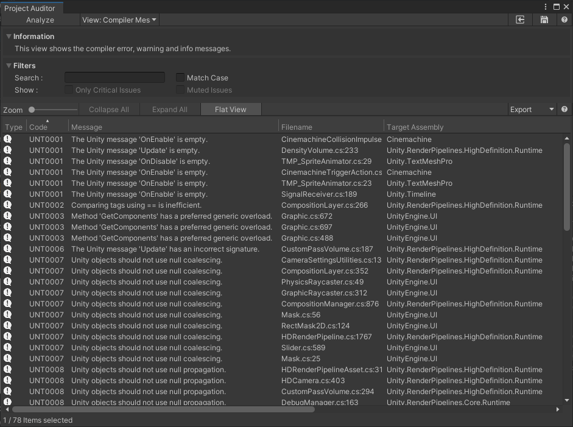
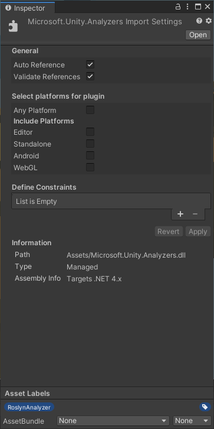

# Compile Messages View
This view shows the compiler error, warning and info messages. These messages are generated by the C# compiler when compiling the project scripts for the target platform. Note that this occurs during the Project Auditor Analysis.

# Roslyn Analysis
Unity 2020 introduced support for Roslyn analyzers. This feature reports all Roslyn diagnostics in the Console window. Project Auditor's Compiler Messages view provides an alternative way to report Roslyn diagnostics.

This feature requires one or more Roslyn analyzer DLLs in the Unity project, tagged with the *RoslynAnalyzer* label. In order to add a label, click in the DLL in the Project Browser and use the inspector:

For more information on Roslyn Analyzers support in Unity, check the [manual](https://docs.unity3d.com/Manual/roslyn-analyzers.html).
