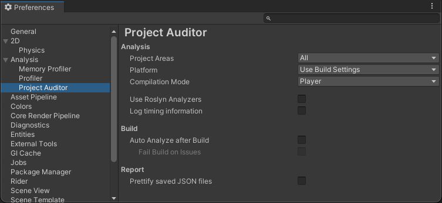

# Configuring Project Auditor analysis

There are two places in the Editor containing options for configuring Project Auditor's behaviour: The Preferences
window and the Project Settings window. Preferences provide access to individual user preferences, which may differ
between different people working on a project, and Project Settings provide options that are applicable to everyone who
works on the project. 

## Preferences

To open the **Preferences** window, go to **Edit > Preferences** (macOS: **Unity > Settings...**) in the main menu.
From here, select **Analysis > Project Auditor**. 
Project Auditor's Welcome View also provides a link to the Project Auditor Preferences, next to the **Start Analysis**
button.

### Analysis
Here you will find the options for configuring how Project Auditor will perform analysis of your project.

#### Project Areas
The **Project Areas** drop-down menu is used to select the broad areas of the project to be included in project
analysis. By default, all areas are selected. If you are only interested in specific areas you can un-tick the areas
you're not interested in to save some time during the initial analysis. If you later decide to enter a View relating to
an area which hasn't been selected for analysis, you will be given the opportunity to run analysis for that area, which
will be added to the report.

The areas are as follows:

| Area                 | Corresponding Modules                                                                                     
|----------------------|-----------------------------------------------------------------------------------------------------------|
| **Code**             | Code Issues, Assemblies, Compiler Messages, Domain Reload                                                 |
| **Project Settings** | Project Settings Issues                                                                                   |
| **Assets**           | Assets Issues, Textures, Meshes, AudioClips, Animator Controllers, Animation Clips, Avatars, Avatar Masks |
| **Shaders**          | Shader Assets, Shader Variants, Compute Shader Variants, Shader Compiler Messages, Materials              |
| **Build**            | Build Report: Build Size, Build Report: Build Steps                                                       |

#### Platform
The **Platform** drop-down menu contains all of the currently-supported platform modules included in your
installed Unity Editor. Because Project Auditor's code analysis compiles the assemblies in your project, this option
allows you to specify the target platform for analysis, which may be different to your current build target. By default,
Project Auditor will use whichever platform is currently targeted in the Build Settings window. 

#### Compilation Mode
The **Compilation Mode** drop-down menu offers further control over which assemblies to compile for code analysis, and
how to treat those compiled assemblies. The default option is **Player**. The options are as follows:

| Compilation Mode   | Description                                                                                                                                                                                                                                                                                                                                                        |
|--------------------|--------------------------------------------------------------------------------------------------------------------------------------------------------------------------------------------------------------------------------------------------------------------------------------------------------------------------------------------------------------------|
| Player             | Code will be compiled for analysis as it would be when making a non-development Player build for the specified target platform. Code inside `#if DEVELOPMENT_BUILD` will be excluded from this analysis.                                                                                                                                                           |
| Development Player | Code will be compiled for analysis as it would be when making a development Player build for the specified target platform. Code inside `#if DEVELOPMENT_BUILD` will be included in this analysis.                                                                                                                                                                 |
| Editor Play Mode   | Analysis will be performed on the assemblies which are used in Play Mode. Because these assemblies are cached by the Editor, Project Auditor skips the compilation step which speeds up analysis. The analyzed code may not be completely representative of the code that would appear in a Player build, but may be a reasonable approximation for many purposes. |
| Editor             | Analysis will be performed only on Editor code assemblies. Select this option to analyze custom Editor code, including the contents of packages.                                                                                                                                                                                                                   |

#### Use Roslyn Analyzers
Project Auditor supports Roslyn analyzers, including one that reports issues impacting domain reload times. Roslyn
analyzers can slow down the code compilation step of the analysis process, so this option can be used to disable Roslyn
support if you don't need it.

#### Log timing information
If enabled, this option will log information about how long each Analyzer took to run in the Console window.

### Build
Here you will find options to configure how Project Auditor interacts with the build process in your project.

#### Auto Analyze after Build
If this option is selected, Project Auditor will run automatically once the build is completed.

#### Fail Build on Issues
If **Auto Analyze after Build** and **Fail Build on Issues** are both ticked, and if the analysis results in 1 or more
Issues found in the project, Project Auditor will log an error to the Console.

### Report
Here you will find options to configure how Project Auditor handles the Reports it generates.

#### Prettify saved JSON files
If this option is ticked, project reports (which are saved as JSON files) will be formatted to make them easier to read.
If the option is not ticked, formatting is not performed, which reduces the file size of reports.

## Project Auditor Settings
To open the Project Auditor settings, go to **Edit > Project Settings > Project Auditor**.

### Rules
Rules which can be used to change the Severity of the Issues reported by Project Auditor. An individual Rule is
characterised as a `DescriptorId` identifying the general Issue, an optional filter identifying a specific instance, and
a Severity to be applied to matching Issues. The Ignore button is implemented by setting the Severity of selected Issues
to "None".

### Diagnostic Params
Diagnostic Parameters are declared inside the Analyzers which use them, and are used by the Analyzers to decide whether
to report an Issue. For example, a parameter which specifies a polygon count, used by the analyzer to report meshes
which have a higher polygon count than the threshold. To override a parameter's value for your project in general, edit
its value in the first entry of the Params Stack. To override a value only for a specific target platform, add a new
entry into the Params Stack representing that platform (if one hasn't been created already), then add a parameter with
the desired name and value.
