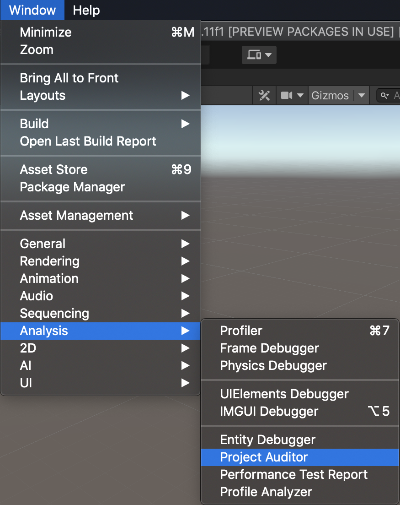
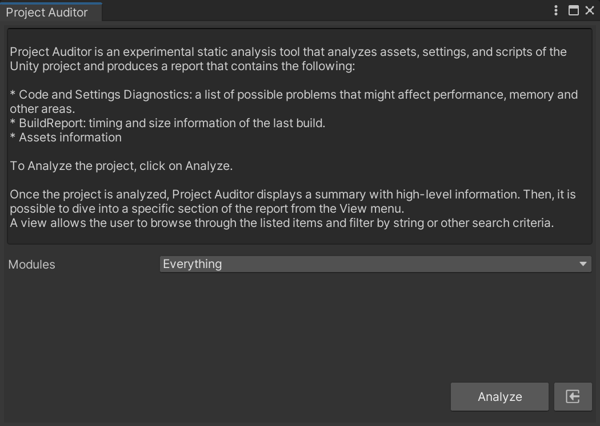
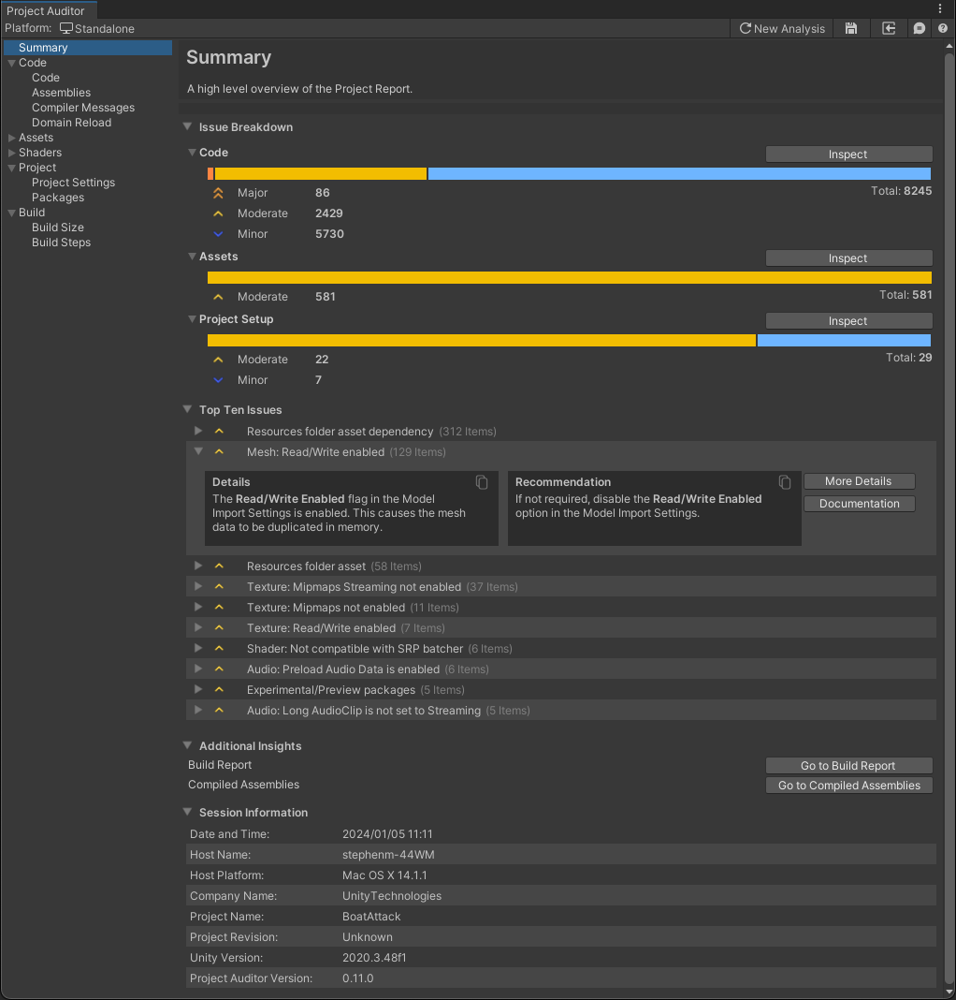
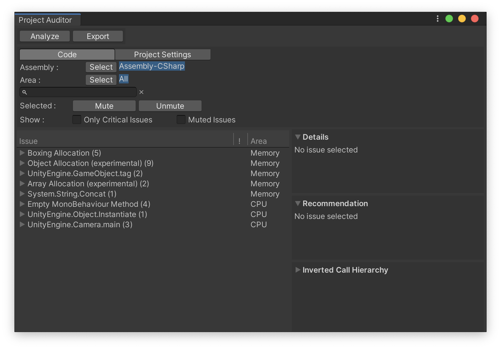
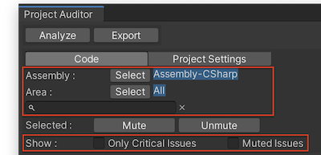
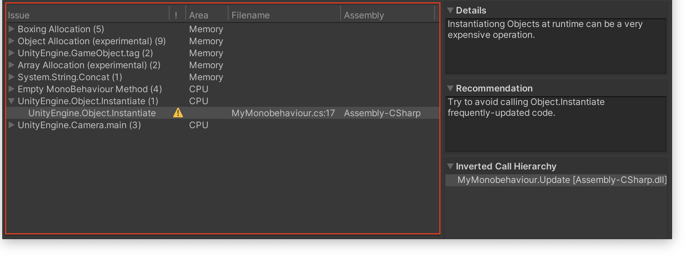
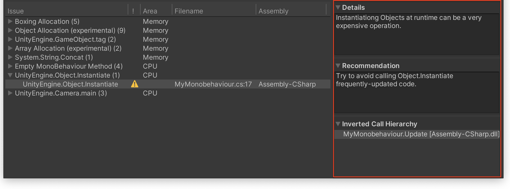
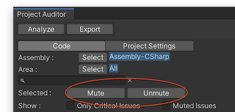

<a name="UsingProjectAuditor"></a>
# Getting Started with Project Auditor
This guide provides a brief overview on how to use Project Auditor.

## User Interface
To open the Project Auditor window in Unity, go to Window => Analysis => Project Auditor.



Once the Project Auditor window is opened. Press *Analyze* to analyse the project.



The analysis might take several seconds, depending on how large the project is. Once the analysis completes, Project Auditor will show a summary of the report.



From the summary it's possible to open one of the diagnostics views (Code or Settings).



The filters allow the user to search through the list of potential issues by string, Assembly and other criterias.



The issues are displayed in a table containing details regarding the impacted area and other properties that depend on the type of issue (such as filename, assembly, etc.)



The panels on the right hand side of the window provide additional information regarding the selected issue. The top panel shows an extended description of the problem, the next panel down contains a recommendation on how to solve the problem, and (when viewing script issues) the bottom panel shows an inverted call tree which allows you to see all of the code paths which lead to the currently-selected line of code.



The mute/unmute buttons can be used to silence specific issues, or groups of issues, that are currently selected.



## Running from command line
Project Auditor is not a standalone application. However, since it is a Unity Editor tool and provides a C# API, its analysis can be executed from command line by launching the editor in batch mode. This requires an editor script that creates a ProjectAuditor instance and runs the analysis, for example:

```
using Unity.ProjectAuditor.Editor;
using UnityEngine;

public static class ProjectAuditorCI
{
    public static void AuditAndExport()
    {
        var assetPath = "Assets/Editor/ProjectAuditorConfig.asset";
        var projectAuditor = new Unity.ProjectAuditor.Editor.ProjectAuditor(assetPath);
        var projectReport = projectAuditor.Audit();
        
        var codeIssues = projectReport.GetIssues(IssueCategory.Code);
        
        Debug.Log("Project Auditor found " + codeIssues.Length + " code issues");
    }
}
```
For more information on how to run Unity via command line, please see the [manual](https://docs.unity3d.com/Manual/CommandLineArguments.html).
