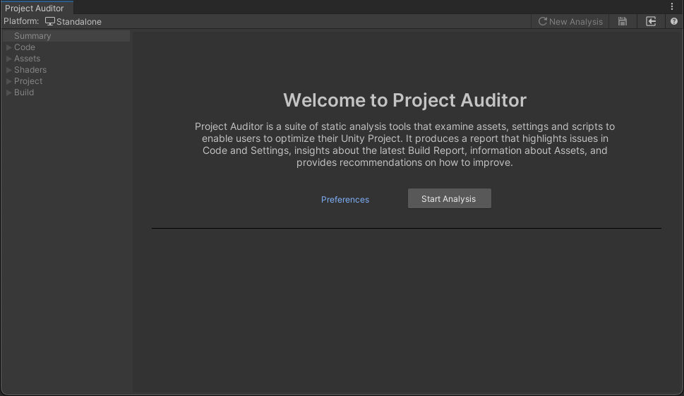
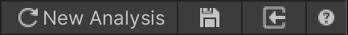
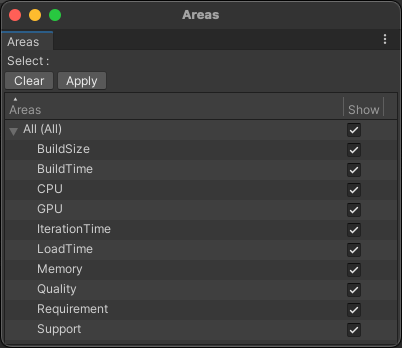

# Getting started with Project Auditor
This guide provides a brief overview on how to use Project Auditor.

## Installation
See the [Installation](./Installing.md) page for installation instructions.

## User interface
To open the Project Auditor window in Unity, go to **Window > Analysis > Project Auditor**.

Once the Project Auditor window is opened, simply press **Start Analysis** to generate a report. By default, Project
Auditor runs all supported modules. However, this behavior can be customized in the Project Auditor Preferences window
by selecting the desired modules before starting analysis. Alternatively, it is possible to load a previously saved
report (json format) by clicking on the **Load Report** button on the Toolbar.

For more information on configuring analysis, see [Configuring Project Auditor analysis](Configuration.md).

The analysis might take a few minutes to complete, depending on the chosen configuration and how large the project is. 
Once the analysis completes, Project Auditor will show a [Summary View](SummaryView.md) of the report.

On the window's toolbar are buttons to perform the following actions, from left to right:

* Discard the current Report and return to the Welcome View to perform a new analysis
* Save the current Report to a file
* Load a Report from file
* Open this package documentation in a browser window

The rest of the Summary View contains high-level information about some of the Issues and Insights found in the project,
and about the analysis session and project itself.

Click on one of the buttons to the right of the window to go to the corresponding View, or navigate by clicking a view
in the navigation panel on the left. All of the Views are a little different, but let's look at the Code
Issues View in Code tab as an example:

The sections of this screen are labelled as follows:

* **A:** [Navigation panel](#navigation-panel)
* **B:** [Information panel](#information-panel)
* **C:** [View filter panel](#view-filter-panel)
* **D:** [Table view controls](#table-view-controls)
* **E:** [Report item table](#report-item-table)
* **F:** [Selected item detail panel](#selected-item-detail-panel)
* **G:** [Selected item context](#selected-item-context)
* **H:** [Font size slider](#font-size-slider)

## Navigation panel
Project Auditor's analyzers are grouped into a number of project areas, each of which contains multiple different Views.
Each View displays a different sub-set of the data related to the project area. Select the required View from the
navigation panel to the left of the window.

Some of these Views display _Issues_, and some display _Insights_. Issues are potential problems in your project that
could impact one or more areas of runtime performance or iteration times. They are typically listed at the top of the
list of Views within a particular project area. Insights Views provide information about your project in a way that
might not be easy to see otherwise - for example, a list of all Textures in your project along with their import
settings and file size. 

## Information panel
Check this panel for useful information about the best way to interact with the current View. Some Views require
additional steps in order to populate them with useful information. Other views include useful high-level summaries in
their information panels.

## View filter panel
Project Auditor can often discover an overwhelming number of issues and insights for a project. The filter panel
provides important controls to narrow the list down to view a useful and manageable sub-set of those items.

### Assembly selection
This is available in some code-related Views, to show or hide code issues according to what assembly they were found in.
A common use of this filter is to focus only on issues in your own assemblies whilst ignoring issues in package
assemblies which you may not want to modify.

Click the button to open an overlay window containing all the assemblies. Click the Clear button to un-tick the
checkboxes for all assemblies, or the checkbox next to the "All" item at the top of the list to select them all. Then
tick or un-tick checkboxes as required. Click the Apply button or click outside the overlay window to close it and apply
the selection changes.

### Area selection
The Issues that Project Auditor detects can relate to a number of different areas of project health. Sometimes you may
want to focus on specific areas when browsing issues. The area selection overlay window can be used to apply such
filters.

Click the button to open an overlay window listing the areas which Issues can relate to. Click the Clear button to
un-tick the checkboxes for all areas, or the checkbox next to the "All" item at the top of the list to select them all.
Then tick or un-tick checkboxes as required. Click the Apply button or click outside the overlay window to close it and
apply the selection changes.

### Search
Every View includes the ability to filter the table content using a string search. This is useful when you want to focus
on a particular file, assembly, issue description, or indeed any other string that appears in the table. Type a search
string into the text box and press return to hide all items in the table except for those that contain the search
string. Delete the search string in the text box to cancel the search. 

### Show
Some Views offer additional filters controlled by checkboxes. The screenshot above shows the
Code Issues View which includes a checkbox for showing only code issues in code paths that might be
executed frequently. See the [Code Issues](./CodeIssues.md) manual page for more information.

## Table view controls
This bar of buttons can be found above the Issue/Insight table in every View. From left to right, here is what they do:

| Button              | Purpose                                                                                                                                                                                                                                                                                                                                                          |
|---------------------|------------------------------------------------------------------------------------------------------------------------------------------------------------------------------------------------------------------------------------------------------------------------------------------------------------------------------------------------------------------|
| **Refresh (&#x27F3;)**  | Re-run analysis for this View. Useful if you have made changes to your project since the last analysis and want to see the latest data.                                                                                                                                                                                                                          |
| **Show/Hide Hierarchy** | When this button is toggled on, items will be shown as a hierarchy, grouped according to the "Group By" drop-down selection. When the button is toggled off, items will be shown as a flat table with no groups.                                                                                                                                                 |
| **Group By drop-down**  | Select the criteria by which issues in the table are grouped. This option is disabled when Show/Hide Hierarchy is toggled off.                                                                                                                                                                                                                                   |
| **Collapse All**        | Collapse all expanded groups. This option is disabled when Show/Hide Hierarchy is toggled off.                                                                                                                                                                                                                                                                   |
| **Expand All**          | Expand all groups. This option is disabled when Show/Hide Hierarchy is toggled off.                                                                                                                                                                                                                                                                              |
| **Ignored Issues**      | Click to toggle. When the eye icon is shown, ignored issues are displayed, greyed out. When the eye icon is crossed-out, ignored issues are hidden.                                                                                                                                                                                                              |
| **Export**              | Export the issues in the table to a comma-separated value (.csv) file, suitable for importing into a spreadsheet or a custom tool. Clicking the drop-down button shows options to export all issues in the current view (**All**), only the issues that are visible with the current filter settings (**Filtered**), or only the selected issues (**Selected**). |

## Report item table
The table is the heart of every View. It's where the View's Issues or Insights are displayed. Each View's tables has
slightly different columns, depending on the information being displayed. All tables can be sorted by any column, by
clicking on that column's header. Columns can be resized as required. Right-clicking on the column headers shows a menu
in which columns can be shown or hidden. 

## Selected item detail panel
In some Views, selecting a report item can show more details in the panel on the right. In Views showing Issues, this
typically takes the form of a Details box containing a more in-depth description of the issue, and a Recommendation box
containing advice on what to do to resolve the issue. Both boxes contain a button to copy their respective text to the
clipboard.

The selected item detail panels for Issues will also contain some combination of the following buttons:

* **Documentation:** Open a link to more detailed online documentation in a web browser.
* **Quick Fix:** For Project or Import Settings issues, automatically fix the setting described in the issue.
* **Ignore:** Project Auditor can report false positives. If you have investigated a reported issue and concluded that it's not a real problem, select the issue and click the Ignore button to hide it.

## Selected item context
In some Views, a bottom panel may show additional context for a selected report item. In the Code Issues View, this
panel shows an inverted call hierarchy. Expanding this reveals all of the methods which lead to the call site of the
reported issue. In the Asset Issues View, this panel may show a chain of references - for example, to illustrate why an
asset might be included in every build due to a reference chain leading back to a Resources folder.

## Font size slider
In the bottom right of the window you can see the current Project Auditor package version, alongside a slider which can
be used to increase the text size for accessbility purposes.

## Running from command line
Project Auditor can be run via a scripting API, which can be useful for performing automated analysis in a CI/CD
environment. See the [Scripting API Overview](./API.md) page for more information.
