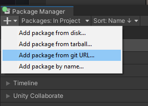

# Installing Project Auditor
There are several ways to install Project Auditor. Choose the most appropriare method based on your needs.

## Installing as read-only Package
At this time, Project Auditor is not discoverable via Package Manager so it has to be installed from its Git repository. The instructions that follow are specific to Project Auditor, however, more infromation on how a package can be added to a project as a dependency from Git, you can check the Package Manager [documentation](https://docs.unity3d.com/Manual/upm-git.html).

### Package Manager UI
The easiest way to install Project Auditor in Unity 2018 (or newer) is via Package Manager in three simple steps.

* Click on _Code_ and copy the repository URL to the clipboard:


* In Package Manager, click on the + button (top left) and select _Add package from git URL_:



* Paste the URL and click _Add_:
 


### Adding Project Auditor's URL to the project manifest
Add `com.unity.project-auditor` as a dependency to the project `Packages/manifest.json` file:

```
{
  "dependencies": {
    "com.unity.project-auditor": "https://github.com/Unity-Technologies/ProjectAuditor.git",
  }
}
```

To install a specific version, simply add `#<version>` at the end of the URL. For example:

```"com.unity.project-auditor": "https://github.com/Unity-Technologies/ProjectAuditor.git#0.4.2-preview"```

A list of releases can be found [here](https://github.com/Unity-Technologies/ProjectAuditor/releases).

## Installing for Development
* In Unity 2018 (or newer), simply _clone_ the repository to the `Packages` folder of your project.
* In Unity 2017 (or older), _clone_ the repository to the `Assets` folder of your project.
