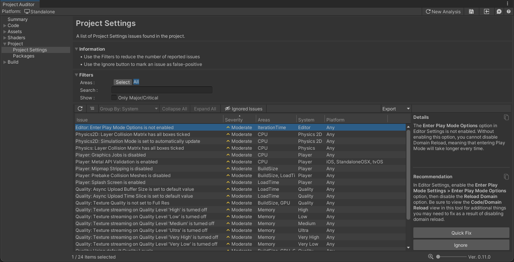

# Project Settings View
The Project Settings view reports Issues found in the project's settings. For each issue, this view also provides an 
explanation of the problem and a recommended course of action to resolve the issue.

To open the Project Settings window, select **Edit > Project Settings...** from the main menu.  

## Issue table

The table columns are as follows:

| Column Name  | Column Description                                                                                                                                                                                                         | 
|--------------|----------------------------------------------------------------------------------------------------------------------------------------------------------------------------------------------------------------------------|
| **Issue**    | A brief description of the Issue.                                                                                                                                                                                          |
| **Severity** | An estimate of how severe the issue might be for your project (Critical/Major/Moderate/Minor).                                                                                                                             |
| **Areas**    | The area(s) impacted by the Issue. Project Settings Issues can impact a wide range of project areas.                                                                                                                       |
| **System**   | The feature or system which contains the setting related to this Issue. In practical terms, this should match the name of one of the items in the left panel of the Project Settings window.                               |
| **Platform** | The build target(s) which may be affected by this issue. Most Issues are likely to exist across all platforms, but some Issues only affect, or disproportionately affect, a smaller subset of Unity's supported platforms. |

As in other Issues Views, this View provides several filtering tools. These are often useful to narrow down the list of
reported issues, especially on large projects. The [Getting Started](GettingStarted.md) guide contains a more detailed description of
the View Filter Panel.

Issues in this View typically show a Quick Fix button in the selected item detail panel when they are selected. If you
click this button, Project Auditor will automatically change the setting as described in the **Recommendation** panel on
your behalf. Be sure to read the **Details** and **Recommendation** first to be sure that you actually want to make the
change. Alternatively, you can double-click on an issue in the table to be taken to the relevant page in the Project
Settings window to examine and change settings yourself.

As with other Issues Views, selected issues also display an **Ignore** button in the selected item detail panel, which
can be useful in cases where Project Auditor reports false positives. If you have investigated a reported issue and
concluded that it's not a real problem, select the issue and click the Ignore button to hide it.
