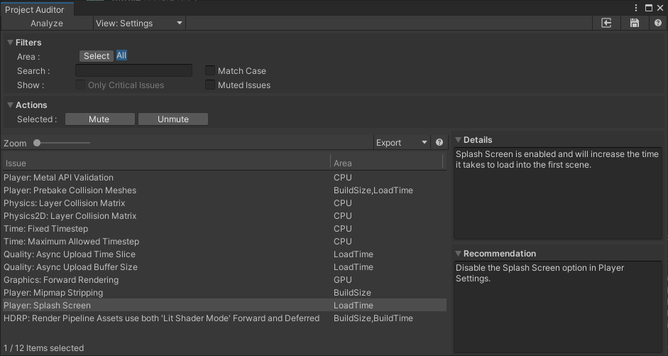

# Settings View
This view reports all Project Settings diagnostics.

As other diagnostic views, it allows the user to filter by several criterias. In addition, it provides an explanation of the problem and a possible solution.

If the user determines the reported issue is not relevant or is a false positive, it is possible to mute the selected issue(s) so they are not reported on the next analysis.
