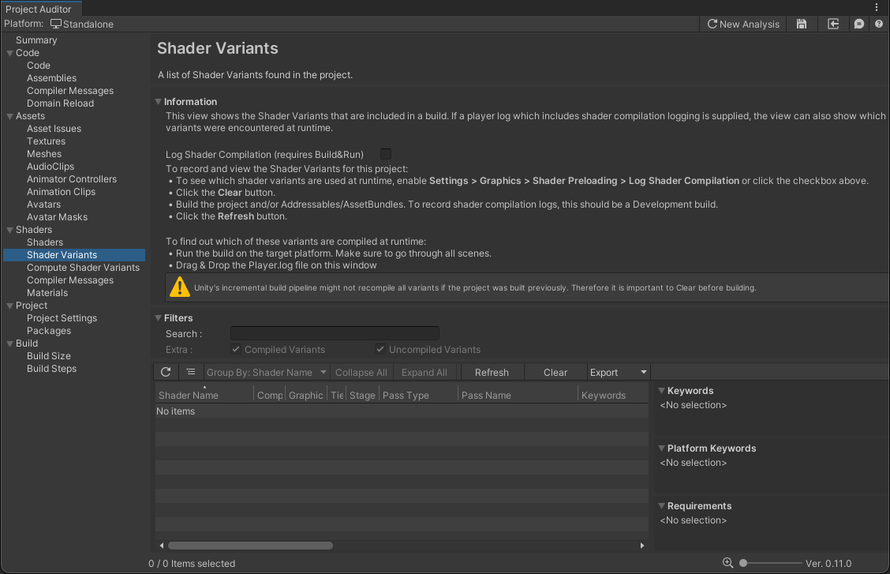
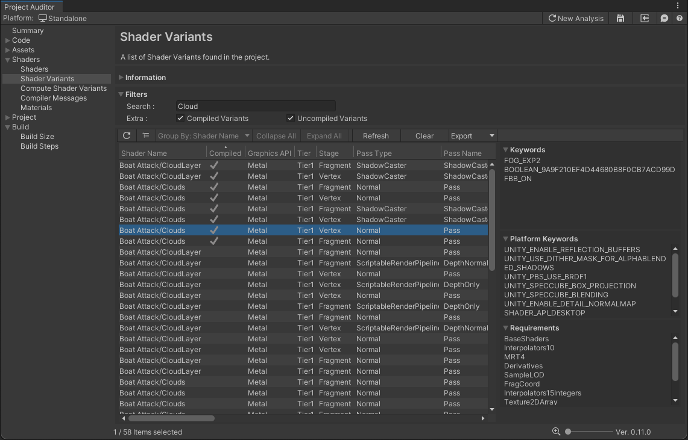

# Shader Variants View
The Shader Variants view reports all shader variants included in the build.

Note that built-in shaders are included only after building the project for the target platform.

When you first view the Shader Variants View, you may find that the table is empty and the Information panel contains
instructions for building your project. The shader stripping process only happens by triggering a build, so Project
Auditor requires a clean build to be triggered whilst the window is open.

*How the Shader Variants View looks initially*

## Viewing built shader variants
To view the built Shader Variants, run your build pipeline and Refresh:
* Click the **Clear** button
* Build the project and/or Addressables/AssetBundles
* Click the **Refresh** button

## Runtime shader compilation
To also view which Shader Variants were requested and compiled at runtime:
* Before building, enabled **Settings > Graphics > Shader Preloading > Log Shader Compilation**
* Ensure that the build you create is a Development build
* Run the build on the target platform. Be sure to test every scene and view in the build if you want to generate a complete list of compiled variants.
* Stop running the build, and locate the [Player.log](https://docs.unity3d.com/Manual/LogFiles.html) file. Drag and drop this file onto the Shader Variants View.

By following the above steps, Project Auditor will parse the compilation log and populate the *Compiled* column. For
example:

*Shader Variants View after successfully creating and running a build and parting the player log. Filtered to show cloud
shaders, sorted to show which variants were compiled, with one variant selected to show its keywords and requirements.*

## Issue table

The table columns are as follows:

| Column Name           | Column Description                                                                                                                                                                                                                                                     | 
|-----------------------|------------------------------------------------------------------------------------------------------------------------------------------------------------------------------------------------------------------------------------------------------------------------|
| **Shader Name**       | The name of the shader that includes this shader variant.                                                                                                                                                                                                   |
| **Compiled**          | Shows a tick if this shader variant was compiled and used at runtime, as reported in a player log.                                                                                                                                                                     |
| **Graphics API**      | The graphics API which this shader variant targets.                                                                                                                                                                                                                    |
| **Tier**              | In the Built-in Render Pipeline, indicates the hardware tier that this shader variant targets. See [Graphics tiers and shader variants](https://docs.unity3d.com/Manual/graphics-tiers.html#shader-variants) for more information.                                     |
| **Stage**             | The stage in the rendering pipeline in which this shader variant runs. See the [ShaderType](https://docs.unity3d.com/ScriptReference/Rendering.ShaderType.html) API documentation for a full list of stages.                                                           |
| **Pass Type**         | The shader pass type in which this shader variant runs. See the [PassType](https://docs.unity3d.com/ScriptReference/Rendering.PassType.html) API documentation for more information.                                                                                   |
| **Pass Name**         | The name of the shader pass in which this shader variant runs.                                                                                                                                                                                                         |
| **Keywords**          | A list of all the shader keywords that represent this specific shader variant. See the selected item detail panel to the right for an alternative view of this keyword list.                                                                                           |
| **Platform Keywords** | A list of all the [BuiltInShaderDefine](https://docs.unity3d.com/ScriptReference/Rendering.BuiltinShaderDefine.html) keywords set by the Editor for this shader variant. See the selected item detail panel to the right for an alternative view of this keyword list. |
| **Requirements**      | A list of all the [ShaderRequirements](https://docs.unity3d.com/ScriptReference/Rendering.ShaderRequirements.html) features required by this shader variant. See the selected item detail panel to the right for an alternative view of this requirement list.         |
