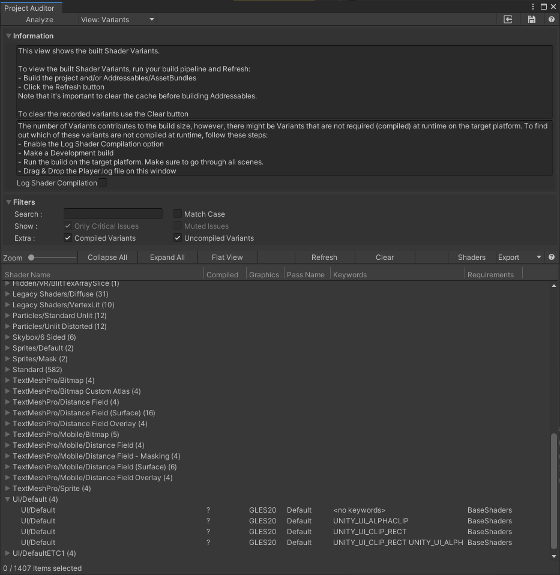

# Shader Variants View
This view reports all shader variants included in the build.

Note that built-in shaders are included only after building the project for the target platform.

# How to Use
To view the built Shader Variants, run your build pipeline and Refresh:
* Build the project and/or Addressables/AssetBundles
* Click the *Refresh* button
Note that it's important to clear the cache before building Addressables.

To clear the recorded variants use the *Clear* button

# Runtime Shader Compilation
The number of Variants contributes to the build size, however, there might be Variants that are not required (compiled) at runtime on the target platform. To find out which of these variants are not compiled at runtime, follow these steps:
* Enable the Log Shader Compilation option
* Make a Development build
* Run the build on the target platform. Make sure to go through all scenes.
* Drag & Drop the Player.log file on this window

By following the above steps, Project Auditor will parse the compilation log and populate the *Compiled* column. For example:

