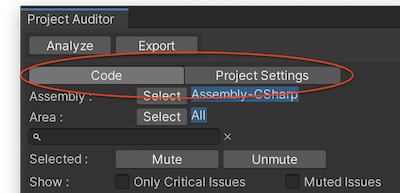

# About Project Auditor
Project Auditor is a static analysis tool for Unity projects, which finds potential issues related to memory consumption, performance and other areas.

Use the Project Auditor package to analyse scripts and settings of your project. The tool creates a list of potential issues which have been identified, then the user will need to determine whether they are real issues or not.

## Preview package
This package is available as a preview, so it is not ready for production use. The features and documentation in this package might change before it is verified for release.


# Installing Project Auditor
Project Auditor can be installed as a package in Unity 2018+, or added to the `Assets` folder in previous versions of Unity.
### Unity 2018 or newer
Add `com.unity.project-auditor` as a dependency to the project `Packages/manifest.json` file:

```
{
  "dependencies": {
    "com.unity.project-auditor": "https://git@github.com/mtrive/ProjectAuditor.git",
  }
}
```

Alternatively it's possible to clone the repository, or decompress the pre-packaged zip, to the `Packages` folder of your project.

### Unity 2017 or older
Clone this repository to your Unity project as follows:

```
cd Assets
git clone https://github.com/mtrive/ProjectAuditor.git
```

<a name="UsingProjectAuditor"></a>
# Using Project Auditor
To open the Project Auditor window in Unity, go to Window => Analysis => Project Auditor.


Once the Project Auditor window is opened. Press *Analyze* to analyse the project.


The analysis might take several seconds, depending on how large the project is. Once the analysis completes, Project Auditor will show the report of potential issues, filters and additional information.


The issues are categorized based on whether they are found in code or project settings. The active category can also be changed.



The filters allow the user to search through the list of potential issues by string, Assembly and other criterias.


The issues are displayed in a table containing some details regarding impacted area, filename, etc.


The panels on the right hand side of the window provide additional information regarding the selected issue. The top panel shows an extended description of the problem, the next panel down contains a recommendation on how to solve the problem, and (when viewing script issues) the bottom panel shows an inverted call tree which allows you to see all of the code paths which lead to the currently-selected line of code.


The mute/unmute buttons can be used to silence specific issues, or groups of issues, that are currently selected.


# Technical details
## Requirements
This version of Project Auditor is compatible with the following versions of the Unity Editor:

* 5.6 and later. However, to use it as a package 2018.1 is required.

## Known limitations
Project Auditor version 0.1.x includes the following known limitations:

* It reports issues in code that might be stripped by the build process.
* It is unable to distinguish between cold and hot-paths.

## Package contents
The following table indicates the package directory structure:

|Location|Description|
|---|---|
|`Data`|Contains the issue definition database.|
|`Documentation~`|Contains documentation files.|
|`Editor`|Contains all editor scripts: Project Auditor and external DLLs.|
|`Editor/UI`|Project Auditor Editor window.|
|`Tests`|Contains all scripts required to test the package.|

## Document revision history 
|Date|Reason|
|---|---|
|May 21, 2019|Expanded *Using Project Auditor* section|
|Dec 4, 2019|First draft.|