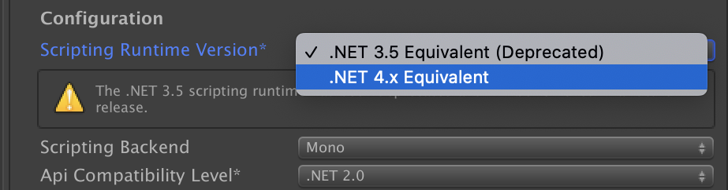

# About Project Auditor
Project Auditor is an experimental static analysis tool that analyzes assets, settings, and scripts of the Unity project and produces a report that contains the following:

* Code and Settings Diagnostics: a list of possible problems that might affect performance, memory and other areas.
* BuildReport: timing and size information of the last build.
* Assets information

## Requirements
* Project Auditor is compatible with Unity versions from 2018.4 to the latest [Long-Term Support](https://unity3d.com/unity/qa/lts-releases) (recommended). 
* .NET 4.x is required. Check the Project Settings to make sure a compatible .NET is selected.  

> **Note**: The most recent Project Auditor version to support 2017 or earlier is [0.5.0-preview](https://github.com/Unity-Technologies/ProjectAuditor/releases/tag/0.5.0-preview).

## Disclaimer
This package is available as an experimental package, so it is not ready for production use. The features and documentation in this package might change before it is verified for release. 

## Installation

To install this package, refer to the instructions that match your Unity Editor version: 

### Version 2021.1 and later

To install this package, follow the instructions for [adding a package by name](https://docs.unity3d.com/2021.1/Documentation/Manual/upm-ui-quick.html) in the Unity Editor. The package's name is com.unity.project-auditor .

### Version 2020.3 and earlier

To install this package, follow the instructions for [installing hidden packages](https://docs.unity3d.com/Packages/Installation/manual/upm-ui-quick.html). 

## How to Use
The Project Auditor editor window can be opened via *Window => Analysis => Project Auditor*. Click the Analyze button, then select a _View_ from the drop-down menu to review the list of potential issues to determine whether they are actual problems in your project. Every View provides:

* A series of filters to narrow down the visible list of issues
* The ability to "Mute" issues which have been investigated and found not to be a problem
* The ability to export the View to a .csv file for use in build reports or automated testing

For more information, check the [Getting started](GettingStarted.md) guide.

For information on a specific view, check the corresponding page.

### Diagnostics
* [Code](Code.md)
* [Settings](Settings.md)

### Compiler Messages
* [C# Compiler Messages](CompilerMessages.md)
* [Shader Compiler Messages](ShaderMessages.md)

### Code and Assemblies Information
* [Assemblies](Assemblies.md)
* [Generics](Generics.md)

### Assets Information
* [Resources](Resources.md)
* [Shaders](Shaders.md)
* [Shader Variants](Variants.md)

### Build Information (Requires Unity 2019.4 or newer)
* [Build Steps](BuildSteps.md)
* [Build Size](BuildSize.md)

## Table of contents
* [Contents](./TableOfContents.md)

## Reporting issues
If you have issues running Project Auditor in your Unity project, please report them on the [GitHub repository](https://github.com/Unity-Technologies/ProjectAuditor/issues).

## Package contents
The following table indicates the package directory structure:

|Location|Description|
|---|---|
|`Data`|Contains the issue definition database.|
|`Documentation~`|Contains documentation files.|
|`Editor`|Contains all editor scripts: Project Auditor and external DLLs.|
|`Editor/UI`|Project Auditor Editor window.|
|`Tests`|Contains all scripts required to test the package.|

## Document revision history
|Date|Reason|
|---|---|
|Mar 9, 2023|Added table of contents and updated installation instructions|
|Mar 11, 2022|Updated links to view-specific pages|
|Jul 23, 2021|Added view-specific pages|
|Apr 9, 2021|Updated index page with more detail|
|Feb 15, 2021|Updated documentation|
|Oct 16, 2020|Added information about command line execution|
|May 21, 2020 |Expanded *Using Project Auditor* section|
|Dec 4, 2019|First draft.|
