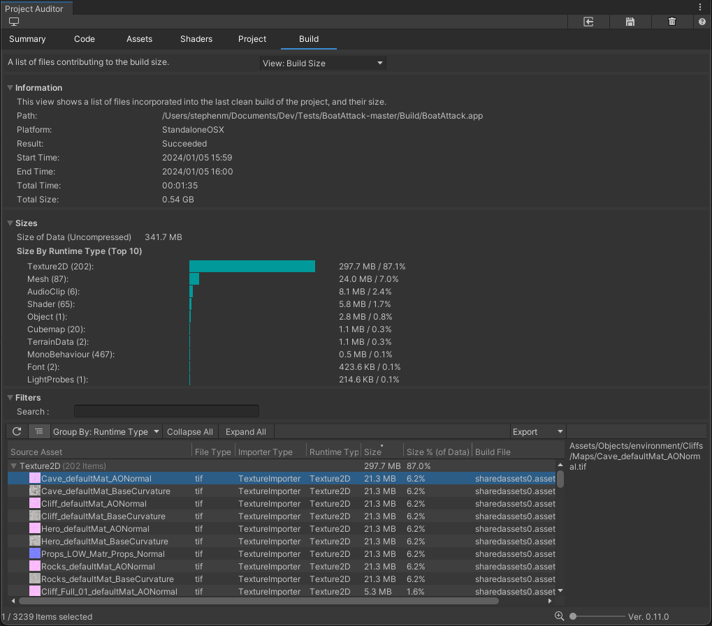

# Build Size View
The Build Size View shows the file sizes of all of the assets that were included in the last clean
[BuildReport](https://docs.unity3d.com/ScriptReference/Build.Reporting.BuildReport.html).

A clean build is important for capturing accurate information about build sizes and steps. For this reason, Project
Auditor does not display the results of incremental builds.

To create a clean build, follow these steps:
* Open the **File > Build Settings...** window.
* Next to the **Build button**, select the drop-down.
* Select **Clean Build**.

If your project uses a custom build script, ensure that it passes the **BuildOptions.CleanBuildCache** option to
**BuildPipeline.BuildPlayer**.

The **Information** panel contains details of the Build Report which the asset file data was extracted from. This View
also include an additional **Sizes** panel which shows a summary of the overall size of the asset data and a breakdown
of the largest asset categories arranged by runtime type. This can help to prioritise areas of investigation if you want
to reduce your application's download/install size.

Both the **Information** and **Sizes** panels can be collapsed if required.

| Column Name      | Column Description                                                                                                                | 
|------------------|-----------------------------------------------------------------------------------------------------------------------------------|
| **Source Asset**     | The filename of the source asset.                                                                                                 |
| **File Type**        | The file type of the source asset.                                                                                                |
| **Importer Type**    | The type of importer used to process the source asset into its runtime type.                                                      |
| **Runtime Type**     | The runtime type of the asset. For example, a .png image file that was imported by the `TextureImporter` to create a `Texture2D`. |
| **Size**             | File size of the imported asset.                                                                                                  |
| **Size % (of Data)** | File size of the imported asset, as a percentage of the combined size of all the assets which were include in the build.          |
| **Build File**       | The filename of the archive file which the imported asset was packed into.                                                        |

