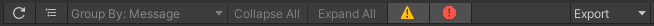

# Shader Compiler Messages View
This view shows shader compiler error and warning messages encountered during the build process.

The table view control bar in this view features additional buttons which can be used to toggle the display of compiler
warnings and errors.

The table columns are as follows:

| Column Name     | Column Description                                                                                                                                                                   | 
|-----------------|--------------------------------------------------------------------------------------------------------------------------------------------------------------------------------------|
| **Log Level**   | The log level of the compiler message (Error/Warning).                                                                                                                               |
| **Message**     | The error/warning message string reported by the compiler. If you select a report item in the table, this message will also be shown in the selected item detail panel to the right. |
| **Shader Name** | The name of the shader that generated the message. Double-click on any report item to automatically open the shader file or in a Shadergraph window.                                 |
| **Platform**    | The graphics API targeted by the shader.                                                                                                                                             |
| **Path**        | The full path and filename of the source shader asset that generated the message.                                                                                                    |
