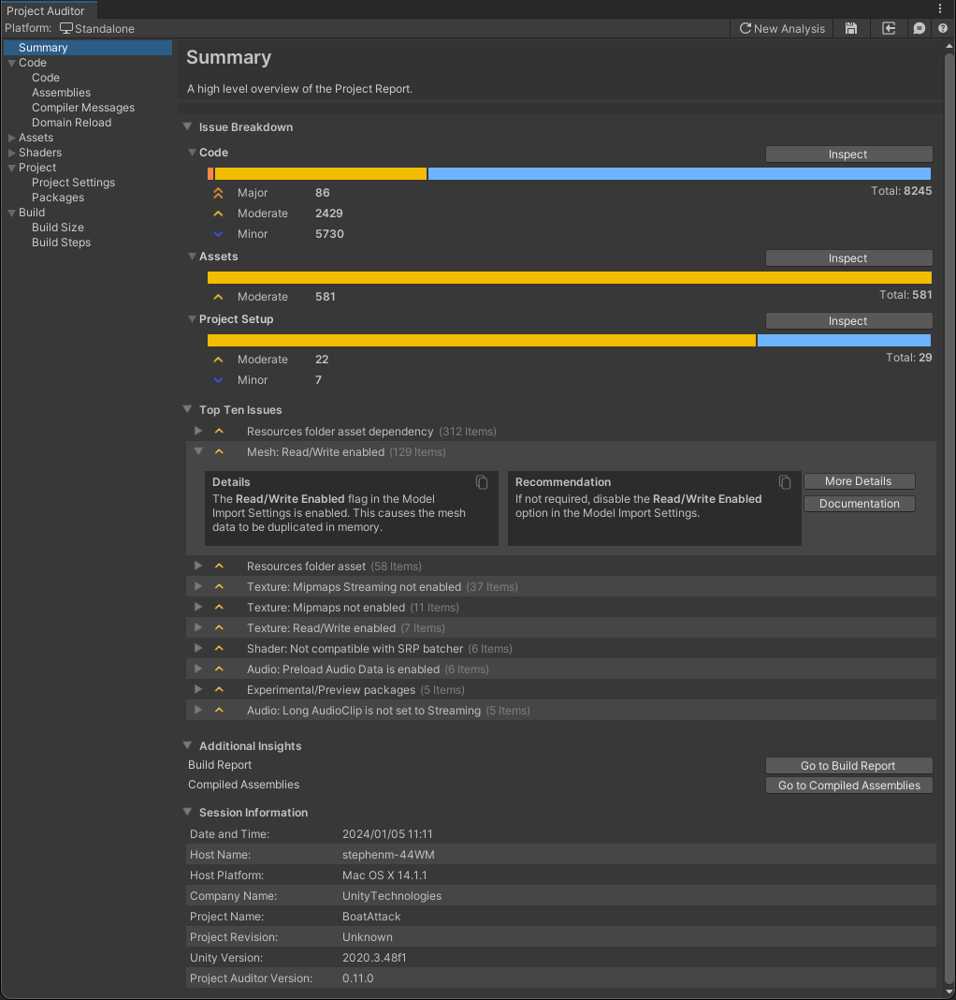

# Summary View
After completing project analysis or loading a Report, Project Auditor displays the Summary View. This view
shows the number of **Issues** and **Insights** that were found in a number of high-level categories. It also includes
**Session Information** which includes the date and time the report was created and basic information about the name and
version number of the project, the Unity version and the Project Auditor package version which was used.

