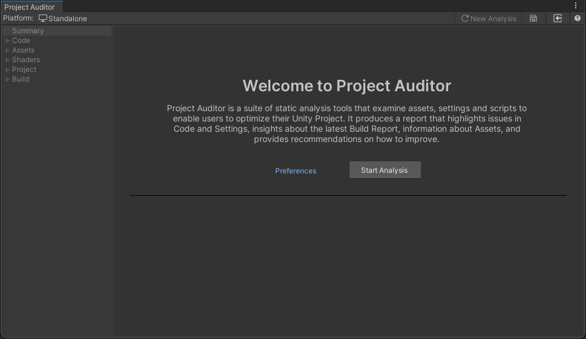

# Welcome View
When the Project Auditor Window is first opened, or when a previously-generated report is discarded, the Welcome View is
shown. At the top of this View there is a brief introductory summary of what Project Auditor can do and how to begin
using it. This is followed by a **Configurations** section providing some options to configure aspects of the analysis,
an **Analyze** button to begin analysis, and a **Load Report** button to load a previously-saved report.

See the [Configuration](Configuration.md) page for more details on configuring Project Auditor analysis. 

